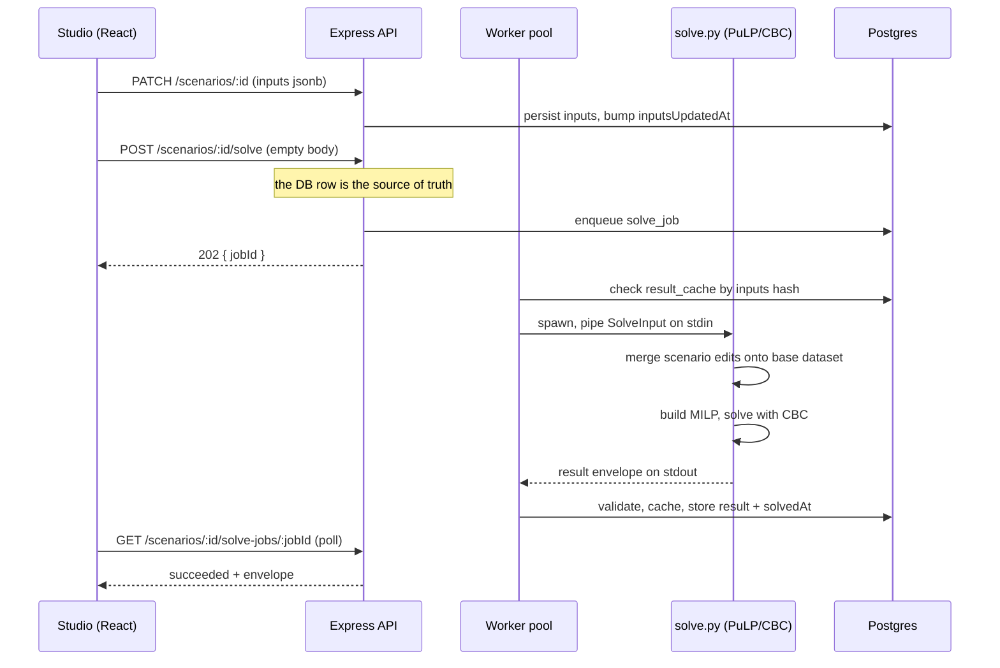
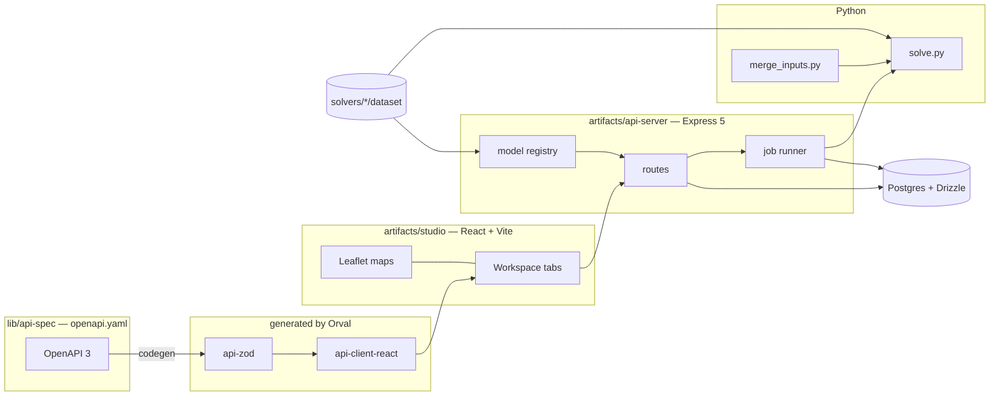

# Network Optimization Studio

**A browser-based supply-chain network design lab.** Students build a facility-location or flow scenario on a live map, hand it to a real MILP solver (PuLP/CBC), and read the optimum back as maps, grids, and cost reports — no notebooks, no Python install, no spreadsheets.

Six textbook models from Watson et al., *Supply Chain Network Design*, are implemented end-to-end and validated against the book's own published answers.

[](https://github.com/ShubhamKr07/network-optimization-studio/actions/workflows/ci.yml)

🔗 **Live:** [nos-studio.onrender.com](https://nos-studio.onrender.com) · API: [`/api/models`](https://nos-api-uwf8.onrender.com/api/models) (Render free tier — first request wakes the service, give it ~30s)

---

## What it does

You pick a chapter, get a real dataset on a real map, and start making decisions:

- **Choose how many facilities to open** (`p`), force specific sites open, deactivate others, cap capacity uniformly or per-site.
- **Edit the network itself** — click the map to add a warehouse, mine, refinery, plant, or customer that isn't in the textbook; drag it to move it; override an individual lane's distance or cost.
- **Solve for real.** The scenario is sent to CBC through PuLP. No heuristics, no precomputed answers — an infeasible scenario comes back infeasible, with a reason.
- **Read the result** as a colored network map, per-band service coverage, open-facility and assignment grids, flow tables, and a cost summary — then compare scenarios side by side.

Everything a student changes is scoped to *their* scenario. The base textbook datasets on disk are never mutated.

## Model catalogue

| Model | Book | Decision | Dataset | Solver |
|---|---|---|---|---|
| **Al's Athletics** `p-median-us` | Ch. 3 | Which *p* of 26 US warehouses to open | 26 WH · 200 customers · 5,200 distances | `solve_pmedian` |
| **Al's Athletics — Max Coverage** `max-coverage-us` | Ch. 4 | Service-level siting in the US — maximize covered demand *or* minimize demand-distance | 26 WH · 200 customers · 5,200 distances (km) | `solve_max_coverage` |
| **Coal Transport LP** `transport-coal` | Ch. 5 | Mine → power-station flow assignment | 4 mines · 15 stations · 60 lanes | `solve_transport` |
| **Brazil Capacity** `p-median-brazil` | Ch. 5 | Capacitated p-median over 25 Brazilian states | 25 sites · 625 distances | `solve_capacitated_pmedian` |
| **JADE Investment** `two-echelon-jade-us` | Ch. 9 | Multi-product plant→warehouse→customer network with plant/product capability | 4 plants · 4 products · 25 WH · 100 customers | `solve_jade` |
| **Gold Refinery Siting** `two-echelon-gold-au` | Ch. 10 | Mine → refinery → customer, with a bill-of-materials ratio across legs | 1 mine · 2 refineries · 10 customers | `solve_two_echelon` |

Each model is a self-describing package on disk:

```
solvers/<model-id>/
  manifest.json      id, chapter, map bounds, capability flags, inputs schema
  dataset/*.json     the textbook data + a version.json carrying a sha256
  tests/             model-specific pytest goldens
```

Drop a new directory in, and the model registry picks it up at boot — `GET /api/models` lists it, the frontend routes to it, the UI gates features off its `capabilities` block. No hardcoded model list anywhere.

## Feature tour

**Tabbed workspace.** Each scenario opens as a tree of tabs — Input Map, per-entity grids (Warehouses / Customers / Mines / Stations / Plants / Distances / Lane Costs / Capability Matrix), Optimization Parameters, then output tabs once solved. Manual save only: nothing is written until you press Save, so a half-finished edit never silently persists.

**Map-first editing.** Click an empty spot on the input map → confirm a draft marker → the entity form opens pre-filled with the clicked coordinates. Left-click an existing entity for details, right-click for move/copy/delete. Added entities get their distances estimated automatically (haversine × a per-model circuity factor) so the solver has a complete matrix.

**Bulk edit via CSV/JSON.** Export any entity table, edit it in a spreadsheet, re-import. The importer classifies every problem as `format` / `syntax` / `logic`, previews the exact changed rows before applying, and offers all-or-nothing or partial modes. Bad rows are skipped, never fatal.

**Asynchronous solving.** `POST /scenarios/:id/solve` enqueues a job (`202 {jobId}`) and returns immediately; an in-process worker pool with configurable concurrency and queue-depth backpressure (`429` + `Retry-After`) runs CBC out of process. The UI polls, shows a live elapsed clock, and never blocks the event loop.

**Content-addressed result cache.** Inputs are hashed; an identical scenario returns a cached envelope without spawning the solver at all.

**Staleness guard.** `Scenario.stale` is derived, never stored (`result != null && inputsUpdatedAt > solvedAt`). Edit an input after solving and the old result stays visible — clearly badged "Stale · re-solve" rather than silently passing itself off as current.

**Pre-solve checks.** A semantic precheck catches zero-demand networks, unreachable customers, and infeasible coverage floors *before* burning a solve.

**Distance bands as a lens, not a constraint.** Bands are computed in post-processing, so re-banding a solved result recolors the map and recomputes coverage instantly, client-side, with zero network calls and no re-solve.

**Reporting.** Open-facility and assignment grids, per-leg average distances, flow tables, plant production rollups, utilization, cost summary with side-by-side scenario compare, a session-local result-history stepper (back/forward through your own solves, inputs restored with each), and one-click "Copy map to clipboard".

## How a solve actually runs



Every model returns the same envelope — `{status, objective, runTimeSec, quality, edges, metrics, details, solverUsed, infeasibilityReason}` — so the entire frontend renders six different optimization problems through one contract.

The wrapper **never throws**: a crash, timeout, or unparseable stdout all degrade to a well-formed `{status: "error", infeasibilityReason}`.

## Architecture



**Contract-first.** `lib/api-spec/openapi.yaml` is the single source of truth. Orval generates the Zod validators and the React Query client from it; generated code is never hand-edited, and a spec change ships in the same commit as its regenerated output.

**Schema-light persistence.** A scenario is `{id, userId, name, modelId, inputs jsonb, result jsonb, ...}`. Model-specific shapes live in per-model Zod schemas selected by `modelId`, not in typed columns — adding a model touches zero DDL.

```
lib/api-spec/          OpenAPI contract + Orval config
lib/api-zod/           GENERATED Zod schemas
lib/api-client-react/  GENERATED React Query hooks
lib/db/                Drizzle schema (Postgres)
lib/dataset-schema/    manifest + dataset validation, version hashing
artifacts/api-server/  Express 5 API, model registry, job runner, Python solver
artifacts/studio/      React + Vite + Tailwind + Radix + Leaflet + TanStack Query
solvers/               six self-describing model packages
docs/                  design system, ops runbooks, specs, plans, metrics
```

~109k lines of hand-written TypeScript/Python (plus ~4.5k generated), 1,317 lines of solver.

---

## Research & engineering notes

The interesting part of this project wasn't the CRUD. It was making a teaching tool that is *provably* faithful to the source material, and keeping it that way across six models.

### We found a real bug in the published textbook notebook

The Chapter 10 source notebook writes its bill-of-materials constraint **per (mine, refinery) pair**. With exactly one mine in the dataset that happens to give the right answer — but it silently over-constrains the moment a second mine exists. `solve_two_echelon` sums the constraint over mines instead, and `test_flow_balance_generalizes` proves the difference by monkeypatching a second mine into the dataset. The reproduction of the notebook's own stored output is exact: objective `386576.9929994568`, Cunnamulla opens, average customer distance `687.5738755210947`.

### Goldens transcribed verbatim, then defended

Ground-truth values are transcribed from the source notebooks' stored cell output, not recomputed and hoped over: JADE scenario 1 objective `254060828.6157`. Chapter 4 has no published answer table; its goldens (`68.4192%` / `53385024`) are the solver's own certified-optimal output on the shipped dataset, frozen in `test_max_coverage.py` and defended by an independent floor-0 equivalence check against `solve_pmedian`. Where a model has ties (multiple optima with equal objective), the test asserts the *objective and the invariant*, never an arbitrary tie-broken city list.

`e2e_accuracy.py` is a property-based A/B harness rather than a value table: for every configurable axis — `p`, capacity, single-source, capacity factor, capability toggle — it runs a pair of solves and asserts the mathematical relationship holds (monotonicity in `p`, LP relaxation bounds, capacity feasibility, flow conservation). It is a protected file: if a change breaks it, the change is wrong.

That protection has teeth. A long-standing "102/102 passed" headline turned out to be inflated by a duplicated dispatch call — the real unique count was 87 — and a timing assertion used strict `> 0` on a value rounded to two decimals, so a sub-10ms LP on a fast CI runner legitimately failed. Both were found by auditing the script's own pass count against a hand count, and fixed with explicit human sign-off.

### Business rules enter as data, never as branches

A standing rule: forced-open sites, inactive facilities, demand overrides, and capacities become **variable bounds and coefficient changes** in the PuLP model — never new `if/else` paths in `solve.py`. This is what keeps six models in 1,300 lines instead of 6,000, and it's why a per-warehouse capacity override was a one-line bound change rather than a new solver.

### Scenario-local network edits

Students can add entities the textbook never had, and override individual pairwise distances, without ever touching the base dataset files. Added entities live in the scenario's `inputs` JSONB; `merge_inputs.py` composes them onto the base dataset at solve time; missing distances for new entities are estimated (haversine, per-model circuity multipliers calibrated per dataset — 1.179 for the gold refinery→customer leg, 1.17 elsewhere). Because estimates only ever touch *added* rows, the textbook accuracy suite still passes unmodified.

### Units, geography, and data provenance

The Chapter 10 notebook labels geographically-mile values as kilometres; relabelling (and *not* converting) preserved the golden objective exactly while fixing the display. Chapter 4 is km-canonical by contract, not by geography — its data is US-based like every other chapter, but the dataset stores distances already converted to km and the solver applies no conversion factor of its own, so stored, solved, displayed, and exported values are all the same number. That contract is what forced distance units to become a first-class, model-derived property across the whole frontend rather than a hardcoded `mi`.

Every dataset package carries a `version.json` with a sha256 so drift is detectable.

### Security posture

Every scenario query filters by the authenticated `user_id`, and non-owned resources return **404, never 403** — a 403 would confirm the row exists and hand out an ID-enumeration oracle. This was audited live against the deployed API with two disposable accounts, which is how a `DELETE` returning `204` instead of `404` for another user's scenario was caught: no data was ever mutated, but the status code alone was a side channel.

### A recurring bug class, closed by construction

The single most common defect in this codebase was structural: a shared component's per-model gate (`modelId === "p-median-us"`) gets extended for one new model and forgotten for its sibling. It recurred five-plus times across two features. It's now closed the right way — models declare `capabilities.outputGrids`, `supportsP`, `supportsReferenceDistances`, `supportsAddedCustomerExclusion` in their manifest, and both the backend route and the frontend tab-gating read the capability list instead of comparing ids. A ten-point registration checklist (`model-integration-precheck.md`) covers what a manifest can't.

### The development harness measures itself

`docs/superpowers/metrics/` is an append-only store of six CSVs — one row per finished task, per gate failure (with a cause taxonomy), per flake audit, per deploy, per docs audit, per permission review. A failure cause appearing twice with no proposed gate automatically drafts a gate document and stops for approval. A weekly GitHub Actions job renders the scorecard and a mechanical documentation-drift audit into a single human-reviewed PR. Permissions granted during development are captured to a ledger, classified risky/broad/ok, and promoted into the tracked allowlist only through a reviewed `@claude allow ...` flow. Unknown values are written as the literal `unknown` — never fabricated.

### Bugs only production could find

Some defects are invisible to every local suite. Shipping surfaced: `import.meta.url` collapsing to the bundle's own path once esbuild merges every module into one file (breaking the solver path in the built server but not under Vitest); Express's default weak ETags turning repeat poll requests into `304`s that the fetch layer treated as errors, silently killing the async solve loop; a static site with no SPA fallback where `/` worked and every nested route 404'd; and a brand-new empty account being unable to create its first scenario because the dialog's JSX lived only in a branch the empty state never reached. Each has a regression test and a documented lesson.

---

## Quality gates

| Layer | Tooling | Scope |
|---|---|---|
| Types | `tsc` across the workspace | every package, including generated output |
| API | Vitest + Supertest | routes, auth, ownership, job runner, import/export |
| Frontend | Vitest + React Testing Library | components, tabs, maps, diff and band logic |
| Solver | pytest | 17 modules — goldens, merge, overrides, network edits, datasets |
| Accuracy | `e2e_accuracy.py` | protected A/B invariant suite, must pass unmodified |
| Browser | Playwright | 19 specs against real dev servers |

169 TypeScript/TSX test files, 17 pytest modules, 19 Playwright specs.

```bash
pnpm run typecheck \
  && pnpm --filter @workspace/api-server test \
  && pnpm --filter @workspace/studio test \
  && (cd artifacts/api-server/src/solver && python3 -m pytest tests/ -x)
```

CI runs the same gate on every push and PR against a Postgres 16 service container.

## Getting started

Requires Node 24, pnpm 9.15.9 (enforced — `npm`/`yarn` are blocked by a preinstall hook), Python 3 with `pulp`, and Postgres.

```bash
pnpm install
pip install pulp pytest --break-system-packages

# API (needs DATABASE_URL)
DATABASE_URL=postgresql://user@localhost:5432/nos_dev PORT=3001 \
  pnpm --filter @workspace/api-server run dev

# schema push (no migration files — Drizzle push)
pnpm --filter @workspace/db push

# frontend, proxied to the API so cookies are same-origin
PORT=5173 BASE_PATH=/ API_PROXY_TARGET=http://localhost:3001 \
  pnpm --filter @workspace/studio run dev
```

Then open `http://localhost:5173`, register an account, and pick a chapter.

Changing the API contract:

```bash
# 1. edit lib/api-spec/openapi.yaml
# 2. regenerate — never hand-edit src/generated/
pnpm --filter @workspace/api-spec run codegen
# 3. commit spec + regenerated output together
```

## Deploying

Render, via the Blueprint in `render.yaml`: `nos-api` (Docker web service), `nos-studio` (static site with SPA fallback), `nos-postgres` (managed Postgres). After the first apply, set `CORS_ALLOWED_ORIGIN` on the API and `VITE_API_BASE_URL` on the static site to each other's assigned URL and redeploy both.

`pnpm smoke --env production` runs seven post-deploy checks from outside Render — CORS preflight, cookie attributes, credentialed fetch, Postgres TLS, baked Vite env, solver presence, and free-tier wakeup. See `docs/ops/smoke.md`.

## Credits

Datasets, models, and expected answers are derived from Watson, Lewis, Cacioppi & Jayaraman, *Supply Chain Network Design* (chapters 3, 4, 5, 9, 10) and the accompanying case notebooks. Built as a teaching tool for that material.

Solver: [PuLP](https://github.com/coin-or/pulp) + [CBC](https://github.com/coin-or/Cbc). Maps: [Leaflet](https://leafletjs.com/) over OpenStreetMap tiles.
